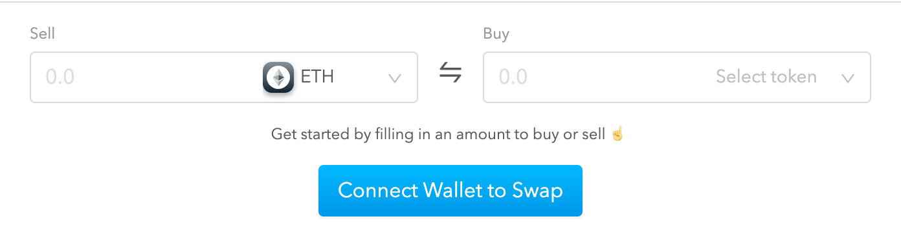

# Overview

Totle is a non-custodial, smart-order routing platform that provides access to all major DeFi liquidity pools via a simple API. Our sophisticated splitting algorithm reviews available liquidity then divides large orders between pools to obtain the best possible execution price in a single order.  
  
To view Totle's source code visit the [Totle Github page](https://github.com/TotlePlatform). 

To access unlimited API calls, earn fees, and become a Totle Partner, [sign-up for an API Key](api/api-key.md).

## Copy and Paste Widget

Instantly add trading functionality to any web interface. [Totle Widget](copy-and-paste-widget.md) allows your visitors to connect their wallet and immediately trade ETH and popular ERC-20s with the assistance of our smart order routing engine. 

Integration requires only a few lines of code to be copied into your HTML.



## API

The Totle API offers developers a familiar way to integrate aggregated exchange functionality into a product. Execute swaps, retrieve pricing data on asset pairs, and query exchanges.

To view the Totle API endpoints and their parameters and learn about response parameters, error messages, and operational details, visit the [API section](api/). 



### Disclaimer

Totle Inc. is not responsible for lost funds and is in no way giving investment advice.

### Support

If you need help or have some feedback for us, send us a message in the [Totle Telegram](https://t.me/totleinc).

