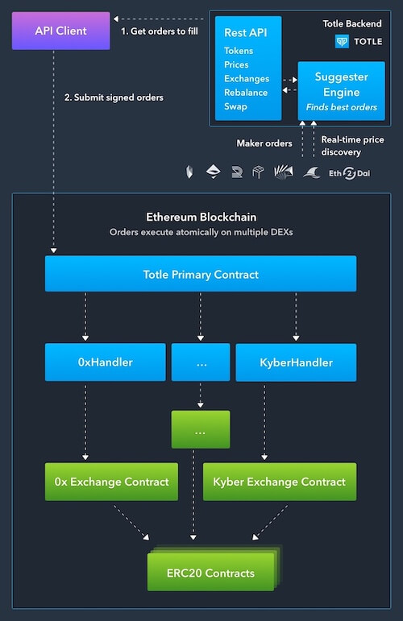

# Operational Details

## Executing Trades



Finding and executing multiple trades atomically is a two-step process:

1. **Get orders to fill**: The client submits a request to the `/swap` endpoint that includes the tokens they want to buy and sell. Totle's Suggester calculates the best way to execute the buy and sell transactions using its aggregated order books and real-time price information. Suggester returns a response to the client that contains a signable transaction payload consisting of orders that can be settled on the blockchain.
2. **Submit signed orders**: The client digitally signs the transaction payload returned by Suggester and sends it, along with the private key for the appropriate wallet, to the Ethereum Network. The Totle Primary Contract translates the payload into a set of sub-transactions that execute on the involved exchanges. These exchanges execute transfers in the ERC-20 contracts for each trade.

## Signing and Submitting a Transaction

The response from the `swap` and `pay` endpoints includes a payload that needs to be signed and submitted to the Ethereum network for mining. You can do this using the [web3](https://web3js.readthedocs.io/en/1.0/#) library's `signTransaction` and `sendTransaction` functions.

There are five steps you need to take to connect a wallet and get started with signing transactions from Totle.

#### 1. Get a Provider

Find a wallet provider that uses the [web3](https://web3js.readthedocs.io/en/1.0/#) library. Alternatively, with a supported browser, you can use the injected web3 provider. [Totle Swap](http://swap.totle.com/) uses [web3connect](https://github.com/web3connect/web3connect#individual-connectors), which allows for a choice of several web3 providers.

#### 2. Connect to a Wallet

Once you've added the wallet library to your application, you can connect to a wallet \(or an injected provider\).

```javascript
if (walletProvider) { // user defined provider
  this.web3 = new Web3(walletProvider)
} else if (window.ethereum) { // injected wallet provider (new standard)
  this.web3 = new Web3(window.ethereum)
  try {
    await window.ethereum.enable()
  } catch (error) {
    // User denied account access...
  }
} else if (window.web3) { // injected wallet provider (old standard)
  this.web3 = new Web3(window.web3.currentProvider)
}
```

#### 3. Fetch Transactions from the Totle API

Get Transactions from the Totle API using the following:

```javascript
const { success, response } = await fetch("https://api.totle.com/swap", requestObject)
```

Details regarding the request object structure is available in Totle's [API Explorer](https://explorer.totle.com/).

#### 4. Parse the API Response

In the response from Totle's API is the transaction object you need. Look for it, and isolate the object for use in the next step. The object should look something like the following:

```javascript
"tx": {
    "to": "0x0d8775f648430679a709e98d2b0cb6250d2887ef",
    "from": "0x5c1739f2a9dcb46e5c2fbac81300af6369e167ef",
    "value": "0",
    "data": "0x...ff",
    "gasPrice": "15001500000",
    "gas": "47233",
    "nonce": "7"
}
```

#### 5. Send the Transaction

Once you have the transaction object, you can send it to the Ethereum network using the following code:

```javascript
for (const transaction of response.transactions) {
  // transaction.type // approval | swap
  web3.sendTransaction(transaction.tx)
    .on('transactionHash', (hash) => {
      console.log('transaction hash', hash)
    })
}
```

## Slippage

There are two forms of slippage that you can control through Totle's API: **market slippage** and **execution slippage**.

**Execution slippage** refers to the change between the quoted price and the actual execution price. You may specify what the allowable execution slippage is when you make a request to the API, otherwise Totle will use a default value of 3%. Any trades where the execution slippage exceeds the allowable value will fail, and none of the client's tokens will move.

**Market slippage** refers to the difference between the quoted price and the price of 0.1 units of the swap's source token. Higher volume trade requests require our engine to go deeper into the order books to find suitable orders, and on-chain pool exchanges quote increasingly higher prices for taking a greater number of tokens from their liquidity pool. We allow clients to specify the allowable market slippage on a per-request basis. The API will return an error for unfavorable trade prices based on market slippage.

##  Token Amounts

When providing token amounts to the API for the `/swap` and `/pay` endpoints, the amount you provide should be in the token's base unit of decimals.

The conversation factor to get this high-precision decimal number is `1*10^(-x)` where `x` is the token decimals. For example, if you're working with 1 MKR, its representation using the token's base unit of decimals is 0.000000000000000001 MKR.

## Gas

Most wallets provide you with the option of setting the gas price for the transaction before you sign and submit it for execution.

In general, setting a higher gas price results in the transaction getting mined sooner, since miners try to maximize the fees they collect when constructing blocks. However, setting a higher gas price is a common way to front-run DEX transactions, so some DEXs try to combat this by setting limits on the gas price. If you set a gas price above these limits, the transaction will fail.

To assist you in finding the appropriate gas price, the `/pay` and `/swap` endpoints includes gas parameters in the response to your call:

```javascript
"gas": {    
    "price": "10000000000",
    "strict": false,
    "limit": "1360000"
}
```

The `price` parameter of the `gas` object is the suggested gas price for the provided payload. You can set a higher gas price, but if the `strict` flag is set to `true`, we recommend using the suggested gas price to minimize the likelihood that the transaction fails. The Totle API selects the gas values to optimize the likelihood the transaction succeeds while also providing you with a fair value.

The `limit` field is the suggested minimum gas limit for the payload provided. It is based on the number of orders to be settled, as well as their complexity, and Suggester's knowledge of the average gas consumed by trades on various DEXs. We recommend setting a gas limit at or above the suggested value.

