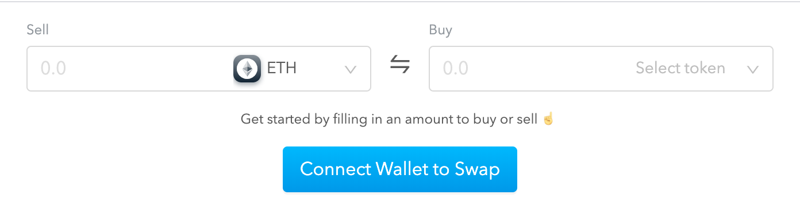

# Copy and Paste Widget

**Copy and paste the snippet of code below into the** `head` **section of your HTML.** 


```javascript
<script>
    const config = {
      sourceAssetAddress: null,
      sourceAmountDecimal: null,
      destinationAssetAddress: null,
      destinationAmountDecimal: null,
      apiKey: null,
      partnerContractAddress: null,
    };
    const nodeId = 'totle-widget';
    !function(){const t=document.createElement("script");t.type="text/javascript";const e=()=>{TotleWidget.default.run(config,document.getElementById(nodeId))};t.readyState?t.onreadystatechange=function(){"loaded"!=t.readyState&&"complete"!=t.readyState||(t.onreadystatechange=null,e())}:t.onload=function(){e()},t.src="https://widget.totle.com/latest/dist.js",document.getElementsByTagName("head")[0].appendChild(t)}();
</script>
```


You will need a `div` with an ID that matches the`nodeId` in the snippet: `totle-widget`

You can do this by copy and pasting the snippet of code below into the `body` section of your HTML where you would like the Widget to appear. 

```javascript
<div id='totle-widget'></div>
```


  If you require a code snippet for non-english speaking users, let us know and we will send you a snippet for the locale you require. 


This is an image of what the Totle Widget will look like in your website. 



To try out a live Totle Widget, follow this link: **swap.totle.com**

### Support

If you need help or have some feedback for us, send us a message in the [Totle Telegram](https://t.me/totleinc).

