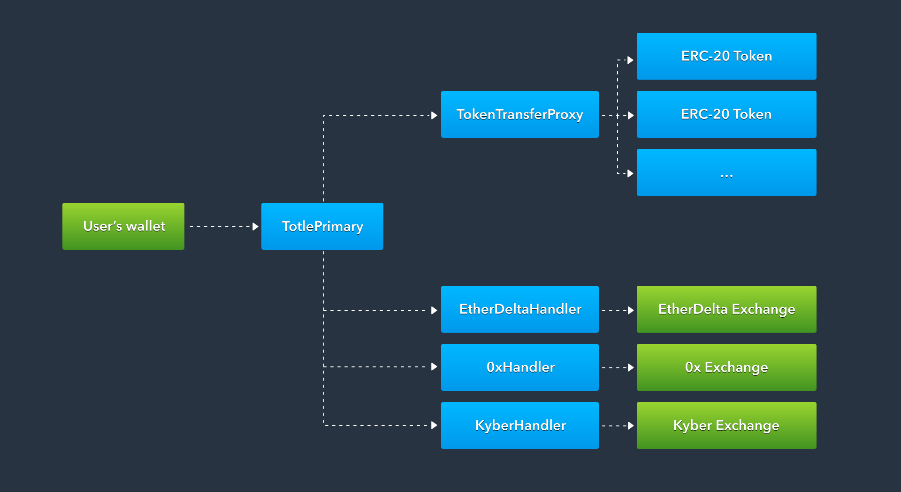

# Architecture

| Smart Contract | Description | Notes |
| :--- | :--- | :--- |
| [Totle Primary](https://github.com/TotlePlatform/contracts/blob/master/README.md#11-totleprimary) | Responsible for all implementation specific logic required by each DEX | This contract is the sole entry point for external transactions and is responsible for performing sanity checks on the payload, executing trades via the respective exchange handler, and keeping count of amounts given and received in order to enforce minimum exchange rate requirements. |
| [Token Transfer Proxy](https://github.com/TotlePlatform/contracts/blob/master/README.md#12-tokentransferproxy) | Responsible for transferring ownership of ERC20 tokens from the user to the `TotlePrimary` contract | `TokenTransferProxy` is responsible for transferring ERC20 tokens from the user to the **TotlePrimary** contract during execution of a swap. The user is required to set an allowance for the **TokenTransferProxy** prior to selling any tokens via Totle. The **TokenTransferProxy** maintains a record of addresses which have been authorized to transfer tokens on its behalf, the only address with this authorization is the **TotlePrimary** contract. In case of an upgrade to the primary contract, Totle is the only authorized party to approve this change. As the platform matures we may implement a safeguarding mechanism such as a multi-sig or time-locked contract to control address authorization and welcome feedback on this from the community. |
| [Exchange Handler](https://github.com/TotlePlatform/contracts/blob/master/README.md#13-exchangehandler) | Responsible for validating and executing individual orders on exchanges | Due to the fact that not all DEXs are built the same, we create a separate **ExchangeHandler** contract for each DEX integrated with Totle that handles implementation details specific to that exchange. These details range from depositing funds prior to initiating a trade to wrapping or unwrapping ether as required. It is a key requirement that we keep DEX logic separate from the primary contract in order to allow for expansion of the platform. |

