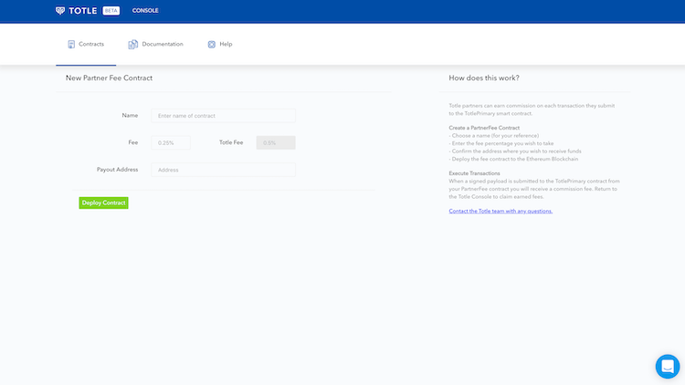

# Partner Contracts

You can create Partner Fee Contracts in just a few steps using the [Totle Developer Console](http://console.totle.com/). This allows you to receive commission whenever a signed payload is submitted to the _TotlePrimary_ contract from your Partner Fee contract.

There are no limits on how many partner contracts you can deploy.


#### Transactions Display

The Developer Console only displays transactions where your MetaMask wallet is either the **creator** or **beneficiary**.


## Create and Deploy Contracts

To create a new contract and deploy it, you'll need to provide:

* A name for the contract
* The fee \(as a percentage\) that you would like to charge per transactions
* The wallet address to which you would like fees to be paid to

Once you have deployed your partner contract, you can include its contract address in your API calls using the `partnerContract` in the payload body to route fees for successful transactions to the contract.

**You can claim the fees you earn at any time using the** [**Developer Console**](http://console.totle.com/)**.**

